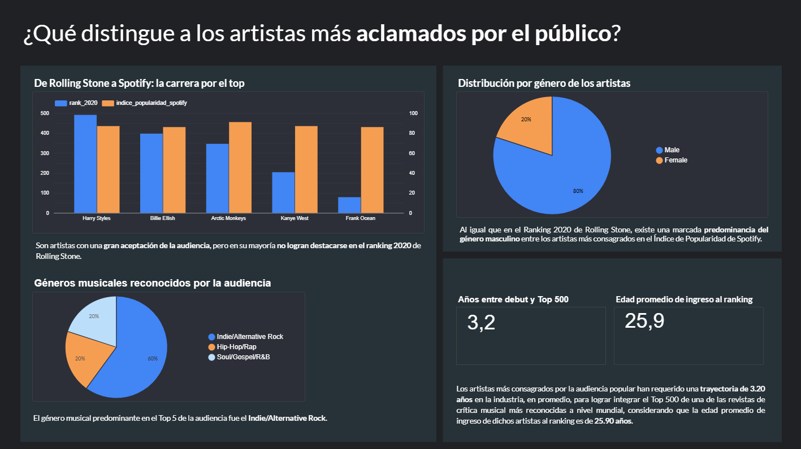
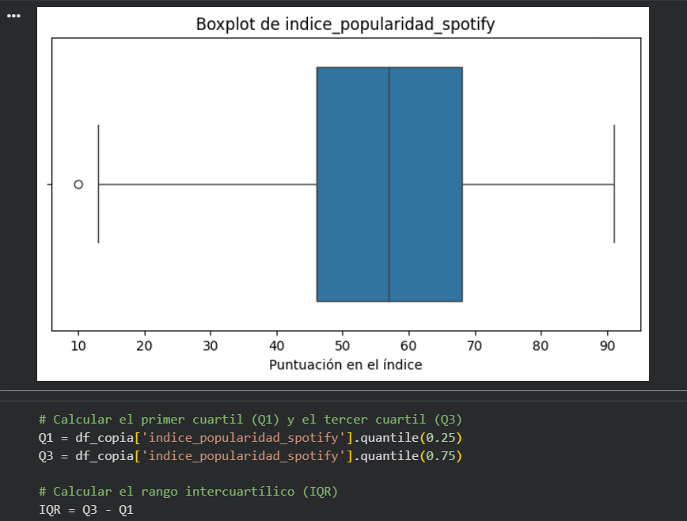

# Rolling Stone vs Spotify Analysis

> Note: The dashboard and final report are in Spanish. The Python notebook is in English.

## Overview
Comparative analysis between Rolling Stone's 2020 ranking and Spotify popularity metrics to explore what critics and the public value in top artists of the streaming era.

## Key Components
- **ETL**: cleaning, transforming, and structuring the dataset  
- **EDA**: exploratory data analysis to identify patterns, trends, outliers, and correlations  
- **Visualizations**: Python charts and interactive dashboard in Looker Studio  
- **Analytical Report**: methodology, KPIs, and insights

## Tech Stack
Python • Pandas • Matplotlib / Seaborn • Looker Studio

## Repository Contents
- `notebooks/etl-eda-visualizations.ipynb` → full ETL + EDA + visualizations  
- `docs/final-analytical-report.pdf` → complete analytical report  
- `dashboard/dashboard-access.pdf` → Looker Studio dashboard access

## Screenshots
### Dashboard - Top 5 Most Popular Artists Analysis

### Notebook - EDA Boxplot

## How to Navigate
1. Start with the analytical report (`final-analytical-report.pdf`) to understand the objectives, methodology, and context.  
2. Review the notebook (`etl-eda-visualizations.ipynb`) for the step-by-step ETL and exploratory analysis.  
3. Access the dashboard (`dashboard-access.pdf`) to explore key insights visually.

## Project Context
Final project for the Data Analysis Bootcamp at Código Facilito.

## Contact
For questions or collaboration:  
[LinkedIn](https://linkedin.com/in/camilabozzoletti)
